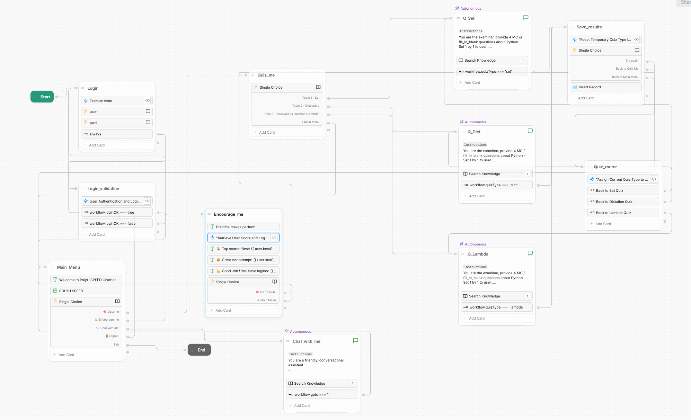
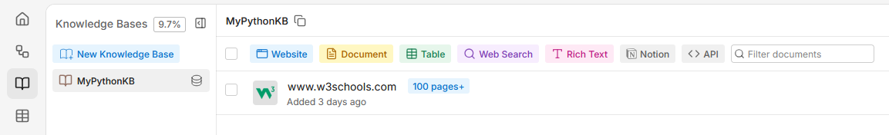
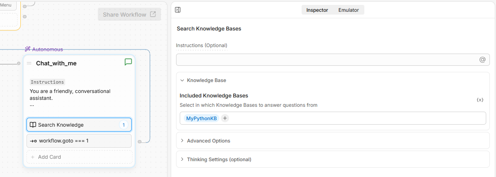

# No-Code Chatbot (Botpress) — Documentation

**Overall Flow:** [Live Demo](https://cdn.botpress.cloud/webchat/v3.6/shareable.html?configUrl=https://files.bpcontent.cloud/2026/03/28/13/20260328131013-PU7I9QAI.json)



---

## Knowledge Base

- Source: w3schools.com (Python pages)
- 
- Connected to the Autonomous Node for "Chat with Me" and all Quiz topic nodes
- 
---

## Login Flow

**Logic:** Preset `loginOK = false` when entering the login node. Whenever the user enters a username and password, it enters `login_validation` to execute code that finds records from `UserTable`. If username and password do not match, it goes back to login. If they match, set `loginOK = true` and go to `Main_menu` node.

### Login Node — Execute Code

```typescript
workflow.loginOK = false
```

### Login_validation Node — Execute Code

```typescript
const rltUser = workflow.rlt_user as any

// Default: assume login fails
workflow.loginOK = false

// Query UserTable for matching credentials
const results = await UserTable.findRecords({
  filter: {
    user: { $eq: workflow.user },
    pwd:  { $eq: workflow.pwd }
  }
})

if (results?.length !== 0) {
  // Set login success flag for Expression card routing
  workflow.loginOK = true

  // Clear password from memory immediately
  workflow.pwd = ''

  // Store matched user info into Object variable
  rltUser.uid  = results[0].id
  rltUser.user = results[0].user
  workflow.rlt_user = rltUser

  // Increment login counter (persists across sessions)
  user.loginCount = (user.loginCount || 0) + 1

  // Log this login session
  try {
    await loginLogTable.createRecord({
      uid: workflow.rlt_user.uid
    })
  } catch (error) {
    console.error('Failed to insert login log:', error)
  }
}
```

- **Login Failed** → loops back to Login node
- **Login Success** → proceeds to Main Menu node

---

## Main Flow

**Logic:** There are 5 options:
- **Quiz** → Quiz Flow
- **Encourage** → Encourage Me Flow
- **Chat** → Chat with Me Flow
- **Logout** → back to Login node
- **Exit** → ends the bot

---

## Quiz Flow

**Logic:** There are 4 options to choose from: Set, Dictionary, Lambda, and Main Menu (back to Main Menu).

There are 3 topic Autonomous nodes (sharing the same knowledge base as "Chat with Me"). Each node provides 4 questions. After completing 4 questions, the marks and quiz topic are recorded to `workflow.score` and `workflow.quizType` respectively. The default value of `workflow.quizType` is `null`.

After `workflow.quizType` is recorded, the flow goes to `save_results` to save `workflow.score`, `workflow.quizType`, and `workflow.rlt_user.uid` to `scoreTable`. After that, if the user chooses **"Try again"**, it goes to `Quiz_router` to check the quiz type and route back to the previous quiz.

### Save_results Node — Execute Code

```typescript
workflow.quizTypeTmp = ''
```

### Quiz_router Node — Execute Code

```typescript
workflow.quizTypeTmp = workflow.quizType
workflow.quizType = '';
```

---

## Encourage Me Flow

### Encourage_me Node — Execute Code

```typescript
// Get best score
const bestScore = await scoreTable.findRecords({
  filter: { uid: { $eq: workflow.rlt_user.uid } },
  group: {
    uid:   'key',
    score: ['max']
  }
})
user.bestScore = bestScore[0]?.scoreMax ?? 0

// Get last score
const recent = await scoreTable.findRecords({
  filter:         { uid: { $eq: workflow.rlt_user.uid } },
  orderBy:        'Created At',
  orderDirection: 'desc',
  limit:          1
})
user.lastScore = recent[0]?.score ?? 0

// Get total quiz attempts
const played = await scoreTable.findRecords({
  filter: { uid: { $eq: workflow.rlt_user.uid } }
})
user.playedTimes = played.length

// Get total login count
const logs = await loginLogTable.findRecords({
  filter: { uid: { $eq: workflow.rlt_user.uid } }
})
user.loginCount = logs.length
```

---

## Chat with Me Flow

- Connected directly to the **Autonomous Node**
- Uses the same Knowledge Base as the Quiz topic nodes (w3schools Python)
- Scoped to Python and programming-related topics only
- Includes a transition back to Main Menu when user says "menu" or "go back"

---

## Tables

### LoginLogTable

| Column | Type |
|--------|------|
| uid    | String |
| *(createdAt — auto)* | Timestamp |

### UserTable

| Column | Type |
|--------|------|
| user   | String |
| pwd    | String |
| *(id — auto UUID)* | String |

### ScoreTable

| Column    | Type   |
|-----------|--------|
| uid       | String |
| score     | Number |
| quizType  | String |
| *(createdAt — auto)* | Timestamp |
