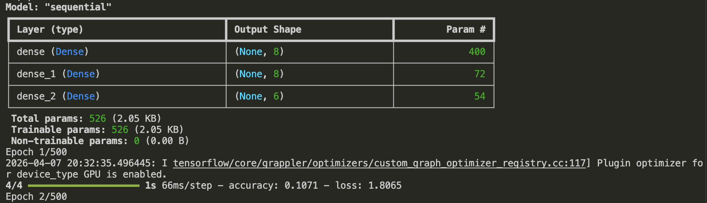
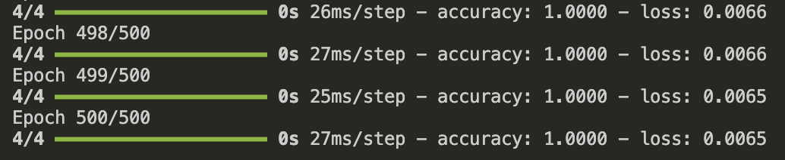
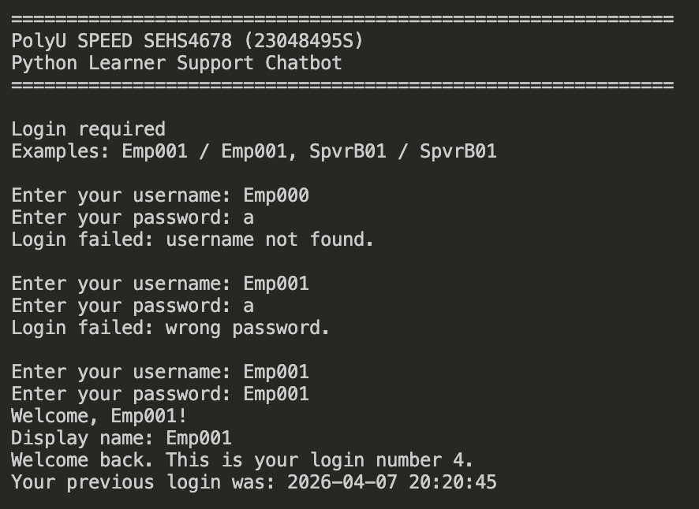
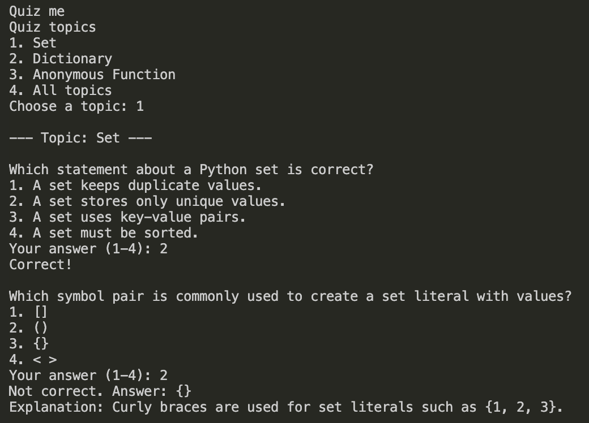
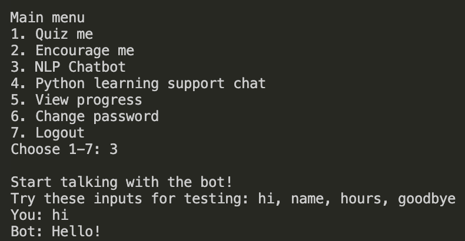
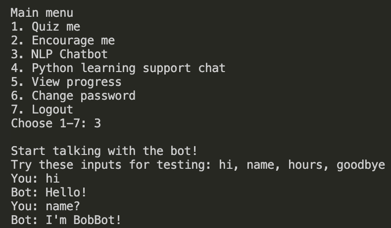
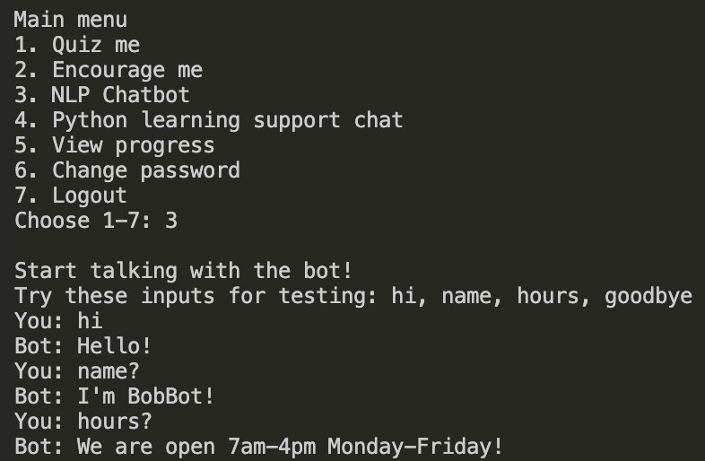
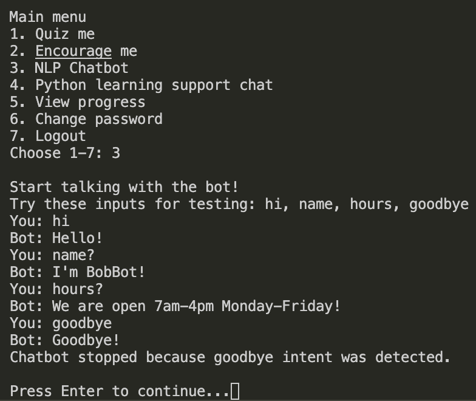

# Python Code - SEHS4678 
**23048495S** | PolyU SPEED | SEHS4678 Artificial Intelligence


**Github:** 
https://appledev0528.github.io/SEHS4678_AI/python_code/
---

## 1. Code Copy Text

### 1.1 Simple `login()` function (before chatbot starts)

```python
def login(users):
    print(BANNER)
    print("Login required")
    print("Examples: Emp001 / Emp001, SpvrB01 / SpvrB01\n")

    for _ in range(3):
        username = input("Enter your username: ").strip()
        password = input("Enter your password: ").strip()

        user = users.get(username)
        if not user:
            print("Login failed: username not found.\n")
            continue

        if user['password'] != password:
            print("Login failed: wrong password.\n")
            continue

        user['login_count'] = user.get('login_count', 0) + 1
        last_login = user.get('last_login')
        user['last_login'] = datetime.now().strftime('%Y-%m-%d %H:%M:%S')

        print(f"Welcome, {username}!")
        print(f"Display name: {user.get('display_name', username)}")
        if user['login_count'] > 1:
            print(f"Welcome back. This is your login number {user['login_count']}.")
        else:
            print("This is your first login. Good start.")
        if last_login:
            print(f"Your previous login was: {last_login}")
        return username, user

    return None, None
```

### 1.2 Simple `quiz()` function (before chatbot starts)

```python
def quiz(user=None, questions=None):
    print("\nQuiz me")
    # Full quiz logic with topic selection and MCQ questions
    # Shows question + options + validates 1-4 input
    print("Question: Which Python data structure stores key-value pairs?")
    answer = input("Your answer: ").strip().lower()
    if 'dictionary' in answer or answer == 'dict':
        print("Correct! A dictionary stores key-value pairs.")
    else:
        print("Suggested answer: dictionary")
```

### 1.3 `chat()` function with goodbye stopping logic

```python
def chat():
    print("\nStart talking with the bot!")
    print("Try these inputs for testing: hi, name, hours, goodbye")

    while True:
        inp = input("You: ").strip()
        tag = get_response_tag(inp)
        response = get_response_from_tag(tag)
        print("Bot:", response)

        # Tutorial 09 required modification:
        # stop when the detected intent tag is goodbye
        if tag == 'goodbye':
            print('Chatbot stopped because goodbye intent was detected.')
            break
```

### 1.4 `model.fit()` with epochs changed to 500

```python
# Epochs changed from 10 to 500
model.fit(training, output, epochs=500, batch_size=8, verbose=1)
```




### 1.5 Required imports

```python
import nltk
import numpy as np
from nltk.stem.lancaster import LancasterStemmer
from tensorflow.keras import layers, models
```

---

## 2. Execution Screenshots

### 2.1 Login


**Expected output:**
Enter your username: Emp001
Enter your password: [hidden]
Welcome, Emp001!
Display name: [name]
This is your first login. Good start.
text

### 2.2 Quiz  


**Expected output:**
Quiz me
Question: Which Python data structure stores key-value pairs?
A) List
B) Tuple
C) Dictionary
D) Set
Your answer (1-4): 3
Correct!
text

### 2.3 Input: `hi`


**Expected output:**
You: hi
Bot: Hello!
text

### 2.4 Input: `name`


**Expected output:**
You: name
Bot: You can call me BobBot.
text

### 2.5 Input: `hours`


**Expected output:**
You: hours
Bot: We are open 7am-4pm Monday-Friday!
text

### 2.6 Input: `goodbye` (stops)


**Expected output:**
You: goodbye
Bot: Goodbye!
Chatbot stopped because goodbye intent was detected.
text

---

## 3. Program Flow Summary

1. **Model trains** with `epochs=500` (shows during startup)
2. **Login** validates username/password from `users.json`
3. **Quiz** shows MCQ before chatbot menu
4. **Menu option 3** runs NLP chatbot
5. **Chat stops automatically** when `goodbye` intent detected

## Files used
- `main.py` 
- `users.json` (login credentials)
- `questions.json` (quiz questions) 
- `intents.json` (NLP training data)
---
